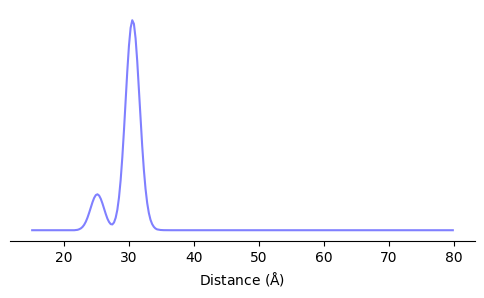
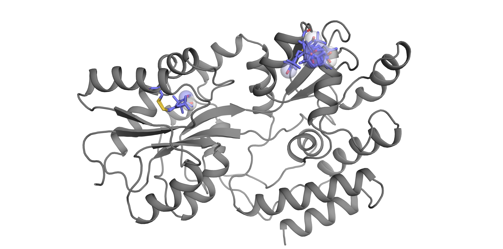

# chiLife
chiLife (or χLife) is a python module for the simulation and analysis of protein EPR experiments. The primary purpose 
of chiLife is to perform *in silico* Site Directed Spin Labeling (SDSL) to simulate experimental results. Rapid, 
accurate and scriptable experimental simulations are necessary for the conversion of experimental data into high quality 
protein models. chiLife aims to achieve this by combining standard side chain modeling methods with commonly used spin 
labels. Furthermore, chiLife offers a scriptable environment allowing users to develop novel protocols unique to their 
protein modeling tasks.
 
## Getting Started
chiLife can be installed by downloading and unpacking the GitHub repository, or using `git clone` followed by a standard 
python setuptools installation.
```bash
git clone https://github.com/mtessmer/chiLife.git
cd chiLife
python setup.py install
```  
***
## chiLife Module
chiLife is most powerful when used as an API for your data analysis and protein modeling pipeline. The primary feature of 
chiLife is the `SpinLabel` object. `SpinLabel`s can be created and attached to protein models easily and quickly, allowing for 
on the fly simulation of distance distributions while modeling. Because chiLife is written in python, in can be easily 
integrated into many python based modeling workflows. Creating a SpinLabel object is easy:

### Simple rotamer-library based SpinLabel modeling

```python
import numpy as np
import matplotlib.pyplot as plt
import chiLife as xl

# Download protein structure from PDB
MBP = xl.fetch('1omp', save=True)

# Create Spin lables
SL1 = xl.SpinLabel('R1C', site=20, chain='A', protein=MBP)
SL2 = xl.SpinLabel('R1C', site=238, chain='A', protein=MBP)

# Calculate distribution
r = np.linspace(0, 100, 256)
P = xl.get_dd(SL1, SL2, r=r)

# Plot distribution
fig, ax = plt.subplots(figsize=(6, 3))
ax.plot(r, P)
ax.set_yticks([])
ax.set_xlabel('Distance ($\AA$)')
for spine in ['left', 'top', 'right']:
    ax.spines[spine].set_visible(False)
plt.show()
```



```
# Save structure
xl.save('MBP_L20R1_S238R1.pdb', SL1, SL2, MBP)
```




### Mimicking MMM and MTSSLWizard
In addition to its own features, chiLife offers spin label modeling methods that mimic the popular MMM and MTSSLWizard 
modeling applications.

```python
import chiLife as xl

MBP = xl.fetch('1omp')
SLmmm = xl.SpinLabel.from_mmm('R1M', site=238, protein=MBP)
SLWiz = xl.SpinLabel.from_wizard('R1M', site=238, protein=MBP,
                                      to_find=50, to_try=1000,  # Equivalent to 'quick' search, default is 'thorough'   
                                      vdw=3.4, clashes=0,  # MTSSLWizard 'tight' setting, default is 'loose' 
                                      )
```

### Local repacking and off-rotamer sampling 
One of the benefits of chiLife is the variety and customizable nature of spin label modeling methods. This includes 
methods to repack a SpinLabel, and it's neighboring amino acids, and to sample side chain conformations that deviate from
canonical dihedral angles and fixed rotamer libraries.

```python
import chiLife

MBP = xl.fetch('1omp')

# Create a SpinLabel object using the MTSSLWizard 'Accessible Volume' Approach
SL1 = xl.SpinLabel.from_wizard('R1C', site=20, chain='A', protein=MBP)

# Create a SpinLabel object by sampling off-rotamer dihedral conformations using the rotamer library as a prior 
SL2 = xl.SpinLabel('R1C', site=238, chain='A', sample=2000, protein=MBP)

# Create a SpinLabel object from a ProEPR.repack trajectory
traj, de, SLs = xl.repack(SL1, SL2, protein=MBP)
```
The repack function will perform a Markov chain Monte Carlo sampling repack of the spin labels, `SL1` and `SL2` and 
neighboring side chains, returning an `MDAnalysis.Universe` object containing all accepted structures of the MCMC 
trajectory, the energy function changes at each acceptance step and new SpinLabel objects attached to the lowest energy 
structure of the trajectory.

SpinLabel objects and neighboring side chains can be repacked using off-rotamer sampling by using the `off_rotamer=True`
option. In the event off rotamer sampling is being used for repacking, it is likely that the desired SpinLabel object is 
not the default rotamer library attached to the lowest energy structure, but instead the ensemble of side chains 
created in the MCMC sampling trajectory. This can be done using the `from_trajectory` class method. 

```python
# Create a SpinLabel object from a xl.repack trajectory with off-rotamer sampling
traj, de, SLs = xl.repack(SL1, SL2, protein=MBP, off_rotamer=True) 
SL1 = xl.SpinLabel.from_trajectory(traj, site=238)
```

Off rotamer sampling can be controlled on a per dihedral basis when repacking with chiLife by passing a list of bools to 
the off_rotamer variable. For example, passing `off_rotamer = [False, False, False, True, True]` will allow for off 
rotamer sampling of only &chi;<sub>4</sub> and &chi;<sub>5</sub>.


### Mutating protein structures
Sometimes you don't want a whole rotamer library, you just want a protein structure mutated at a particular site with 
the most probable spin label conformer. This can be done easily with the `mutate` function.

```python
import chiLife as xl

MBP = xl.fetch('1omp')
SL = xl.SpinLabel('R1C', 238, protein=MBP)
MBP_S238R1 = xl.mutate(MBP, SL)
xl.save('MBP_S238R1.pdb', MBP_S238R1)
```

chiLife can actually mutate several sites at once, and can mutate canonical amino acids as well.

```python
SL1 = xl.SpinLabel('R1C', 20, protein=MBP)
SL2 = xl.SpinLabel('R1C', 238, protein=MBP)
L284V = xl.RotamerLibrary('VAL', 284, protein=MBP)
```

 Mtating adjacent sites is best done with the `repack` function to avoid clashes between SpinLabels/RotamerLibraries. 
This will return a trajectory which can be used to pick the last or lowest energy frame as your mutated protein.

```python
MBP_L284V_L20R1_S238R1, _, _ = xl.repack(SL1, SL2, L284V, protein=MBP)
```

### Adding user defined spin labels
Site directed spin labels, and other site directed labels, are constantly being developed. To this end chiLife makes it 
easy to add user spin labels. To add a user defined spin label, all that is needed is (1) a pdb file of the spin label
(2) A list of the rotatable dihedral bonds, and (3) a list of the atoms where the spin is.

```python
xl.add_label(name='TRT',
             pdb='test_data/trt.pdb',
             dihedral_atoms=[['N', 'CA', 'CB', 'SG'],
                             ['CA', 'CB', 'SG', 'SD'],
                             ['CB', 'SG', 'SD', 'CAD'],
                             ['SG', 'SD', 'CAD', 'CAE'],
                             ['SD', 'CAD', 'CAE', 'OAC']],
             spin_atoms='CAQ')
```

User defined labels can be constructed from a single state pdb file or a multi-state pdb file. If constructed from a 
single state pdb file a list of dihedral angles and weights can be passed via the `dihedrals` and `weigts` keyword
arguments. For each set of dihedral angles, chiLife create a rotamer and store the whole library using the specified 
name. Once a label is added it can be used the same as any other label. e.g.

```python
xl.SpinLabel('TRT', site=238, protein=MBP, sample=5000)
```

For more information on how to use chiLife as a python module, see [examples](#examples/)
