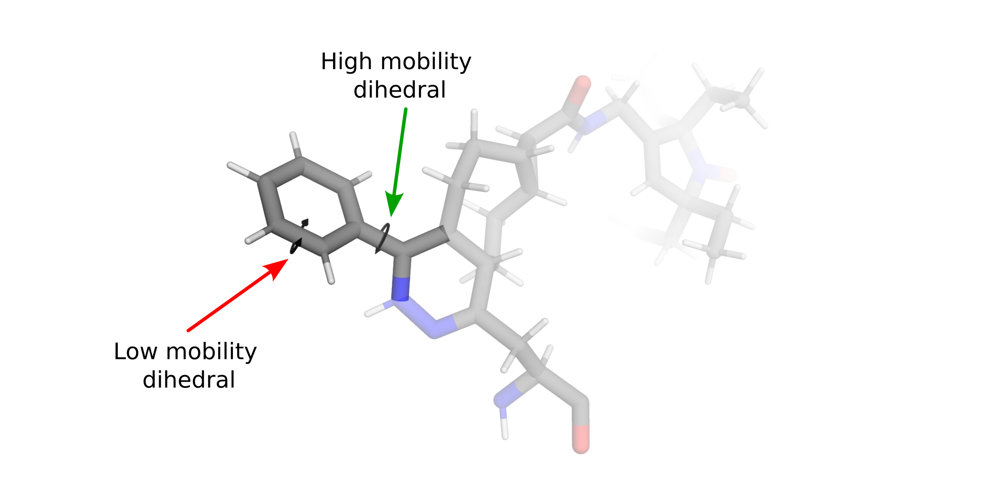
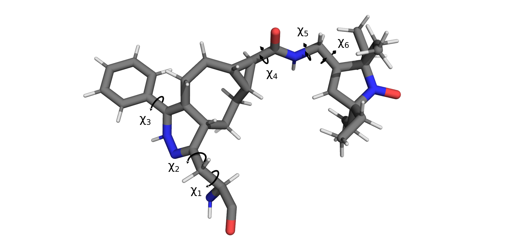

=================
Rotamer Libraries
=================

.. _custom-rotamer-libraries:

---------------------------------
Creating Custom Rotamer Libraries
---------------------------------
A major component of chilife is the creation and sharing of custom rotamer libraries. This is to facilitate rapid
distribution of libraries for novel spin labels and encourage rapid rotamer library testing and development. Rotamer
libraries are added through the :func:`~chilife.chilife.create_library` and  :func:`~chilife.chilife.create_dlibrary`
functions:

..  code-block::

    xl.create_library('XYZ', 'XYZ.pdb', ...)

or by saving an existing :class:`~chilife.RotamerEnsemble` or :class:`~chilife.SpinLabel` object as a rotamer library:

..  code-block::

    mySL = xl.SpinLabel('R1M')
    # Some wizardry to optimize structures, weights, etc.
    ...
    mySL.to_rotlib('myR1')

.. note::
    chiLife :class:`~chilife.dRotamerEnsembles` and :class:`~chilife.dSpinLabels` do not yet have a ``to_rotlib``
    method.

chiLife rotamer library creation is very flexible and offers users many ways to modify their rotamer libraries.
Below we discuss several intricacies of making rotamer libraries with chiLife and general considerations that should be
taken into account when making custom rotamer libraries.

All rotamer libraries in chiLife must start with some sort of structural ensemble that approximates the side chain's
conformational landscape. This can be a very crude approximation, contain only a single or a very detailed
approximation containing several rotamers with different weights and statistical parameters describing dihedral motion
near every rotamer. As a result, there are many different ways in which a rotamer library can be developed.

The fastest and simplest way to develop a rotamer "library" is to create a PDB file of a single conformation of your
rotamer attached to a protein backbone. This can be done with several molecular modeling applications like PyMol,
Avogadro, OpenBabel, etc. Ideally the rotamer's geometry is optimized before passing it to chiLife, either with a
molecular mechanics forcefield like MMFF94, or better yet by DFT with an application like ORCA or Gaussian. For example,
we could create a "library" of the bio-orthogonal nitroxide label Tetv4.0Ph-sTCO-tE5 (TSP) developed by Jana et al.:

.. image:: _static/mono_TSP.png

Once a PDB structure is generated it can be added by passing the rotlib name and pdb file to the
:func:`~chilife.chilife.create_library` function:

..  code-block::

    xl.create_library('TSP', 'TSP.pdb')

.. note::
    All labels in a pdb file passed to :func:`~chilife.chilife.create_rotlib` must have the backbone atoms named using
    standard PDB conventions and all other atoms must have unique names. Additionally all atoms must have the same
    residue number and be on the same chain.

This is the bare minimum required to generate a chilife rotlib and any :class:`~chilife.RotamerEnsemble` generated with
it will only have 1 rotamer that always models in the exact same conformation, regardless of how unfavorable that
conformation is in a given protein environment.

To allow our side chain a little flexibility we can tell chiLife what the mobile dihedrals are.

Defining Mobile Dihedrals
--------------------------

Most labels will have several side chain dihedral angles, some of which will be relatively fixed due to strong
constraints (e.g. rings) and others that will be free to rotate (e.g. χ4 and χ5 of R1) allowing for alternate
conformational states (rotamers).

Because the potential energy differences between rotameric states are generally far lower than bond stretching or angle
distortions, rotations about dihedral angles generally account for the majority of label conformational diversity.
chiLife models this conformational diversity by fixing bond lengths and bond angles while allowing rotations about a
user defined subset of dihedrals. Using our chemical knowledge we can make a few guesses about which dihedrals are most
flexible.

And tell chiLife about them:

..  code-block::
    # Atom names as defined in the PDB file.
    dihedral_defs = [['N', 'CA', 'CB', 'CG'],
                     ['CA', 'CB', 'CB2', 'CG'],
                     ['ND', 'CE3', 'CZ3', 'C31'],
                     ['C01', 'C11', 'C12', 'N12'],
                     ['C12', 'N12', 'C13', 'C14'],
                     ['N12', 'C13', 'C14', 'C15']]

    xl.create_library('TSP', 'TSP.pdb', dihedral_atoms=dihedral_defs)

Now our library can be used to perform accessible volume sampling!

..  code-block::
    MBP = xl.fetch('1anf')
    SL1 = xl.RotamerEnsemble('TSP', 278, MBP, sample=10000, eval_clash=True) # eval_clash=False by default for RotamerEnsembles
    SL2 = xl.RotamerEnsemble('TSP', 322, MBP, sample=10000, eval_clash=True)

.. image:: _static/MBP_E278TSP_E322TSP.png

Defining Spin-atoms and Their Weights
--------------------------------------

Note that we created :class:`~chilife.RotamerEnsemble` objects and not :class:`~chilife.SpinLabel` objects. This is
because we have not told chiLife which atom(s) hold the unpaired electron density. We can tell chiLife approximatly
where this unpaired electron density lives in several ways using the `spin_atoms` keyword argument of the
:func:`~chilife.chilife.create_rotlib` function. We could approximate all the spin density to be on the Nitrogen or
oxygen of the nitroxide ring:

..  code-block::
    xl.create_library('TSP', 'TSP.pdb', dihedral_atoms=dihedral_defs, spin_atoms='N1')
    xl.create_library('TSP', 'TSP.pdb', dihedral_atoms=dihedral_defs, spin_atoms='O1')
    # Atom names as defined in the PDB file

or equally distributed between 'N1' and 'O1' by passing a list:

..  code-block::
    xl.create_library('TSP', 'TSP.pdb', dihedral_atoms=dihedral_defs, spin_atoms=['N1', 'O1'])

or with user defined proportions by using a dict:

..  code-block::
    xl.create_library('TSP', 'TSP.pdb', dihedral_atoms=dihedral_defs, spin_atoms={'N1': 0.4, 'O1': 0.6})

Which would apply 40% of the unpaired electron density on the nitrogen and 60% on the oxygen.

With

Rotation about the dihedral angles are generally the lowest energy pathways to
rotamers that accommodate internal or external clashes. For long, flexible labels like R1, many conformational states will be so close
in free energy that sever
Accordingly the vast majority of conformational diversty of a spin label comes from

Mobile dihedrals are defined using the ``dihedral_atoms`` keyword argument.

Setting Rotamer Dihedrals
-------------------------

Setting Dihedral Variances for Off Rotamer Sampling
----------------------------------------------------

Setting Rotamer Weights
-----------------------

Using Custom Rotlibs
--------------------

--------------------------------------------------------
Differences When Creating Bifunctional Rotamer Libraries
--------------------------------------------------------
